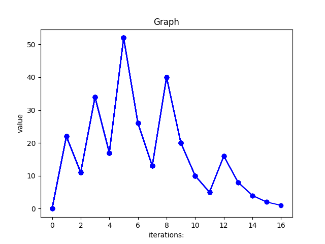

# Collatz Conjecture
The [Collatz Conjecture](https://en.m.wikipedia.org/wiki/Collatz_conjecture) or hailstone sequence is presented here in an **interactive** computer programme to calculate the sequence.</br> 
The sequence is generated by starting with any **positive whole number** greater than zero and by following two **rules.**
1. If the number is odd, then multiply by three and add one ( x3+1)
2. If the number is even, then divide by two (/2)

The sequence will continue till *infinity* due to its nature, however the programme detects the lowest number in the series which is 1 and stops, thereafter, it show some values like no. of **iterations** and **graph** of the generated sequence, then ask to the, user whether to continue the sequence or not.</br>

**Prerequisites:**
* Your computer must be running Python3.9 or newer

### Dependencies
* Below is the library that has been used to plot graphs, it should be installed before executing the programme
```
pip install matplotlib

```
#

### Demo ⏯️

```

Pick a number & Press enter 1 2 3 4 5 6 7 8 9... >>>  7


7  Good choice.

Press Enter to begin !

-> 22 11 34 17 52 26 13 40 20 10 5 16 8 4 2 1

Iterations :  16

```


The programme follow the rules and a sequence is generated ,were the lowest number is one. the conjecture is: every positive integer, if you apply these rules, will eventually end up in the 4, 2, 1 loop.
#
### How?

Here, **1** is odd, multiply by three and add one.</br>
Which equals **4**.</br>
Even, divide by two, **2**, still even.</br>
Divide by two, **1**, odd.</br>
So, **1** goes to **4**, goes to **2**, goes to **1**.</br>

We're in loop and the lowest number is **1**.</br>
#

This is Commonly called the Collatz conjecture, and the numbers obtained by applying **3x+1** are called **hailstone numbers**, beacuse they go up and down like hailstones in a thundercloud, but eventually they all fall down to one.</br>


In above demonstration the number is 7. In total, it takes **16 steps/iterations** to get down to one, and end up in the four, two, one loop.
The **paths** that different numbers take **vary so widely**, below the graph shows the path of number seven.

 `Press enter to see the graph & loop`
#

#
### Looping ➰
```
Close the graph window first !

 Loop....!

->  4 2 1

Iterations: 19

Press enter to see the graph & loop

```

#
# License

Copyright © Abhijeet kumar. All rights reserved.

Licensed under the [MIT License.](LICENSE) 
